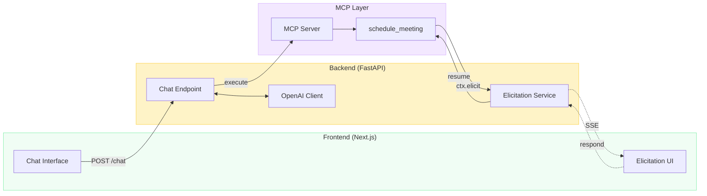
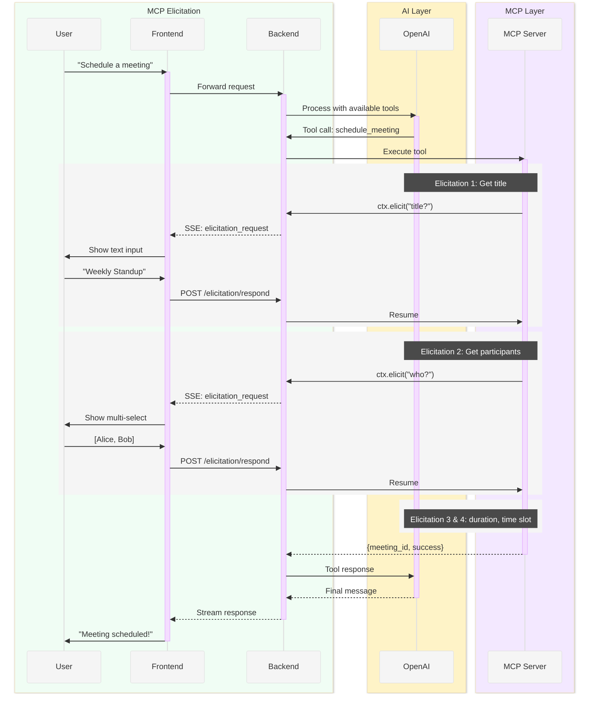

<p align="center">
  
</p>
<h3 align="center">MCP Elicitation</h3>

<p align="center">
  <em>Interactive tool execution with user input collection via MCP Elicitation</em>
</p>

<p align="center">
  <a href="https://quickcall.dev"></a>
  <a href="https://discord.gg/DtnMxuE35v"></a>
</p>

<p align="center">
  <a href="#what-is-mcp-elicitation">What is Elicitation?</a> |
  <a href="#architecture">Architecture</a> |
  <a href="#quick-start">Quick Start</a> |
  <a href="#how-it-works">How It Works</a>
</p>

---

## What is MCP Elicitation?

[MCP Elicitation](https://modelcontextprotocol.io/docs/concepts/elicitation) is a feature of the Model Context Protocol that allows MCP tools to **request additional input from the user** during execution. Instead of requiring all parameters upfront, tools can progressively gather information through a conversational interface.

> **This exact architecture powers [QuickCall](https://quickcall.dev)** — used by developers to get instant answers about their work without context switching.

This app showcases a **Meeting Scheduler** that collects:
- Meeting title (free text)
- Participants (multi-select from available team members)
- Duration (single select from options)
- Preferred time slot (single select from available slots)

<p align="center">
  
</p>

## Architecture



| Component | Technology | Port | Description |
|-----------|-----------|------|-------------|
| **Frontend** | Next.js 15 | 3000 | Chat UI with elicitation rendering |
| **Backend** | FastAPI | 8002 | Orchestrates OpenAI + MCP, manages elicitation state |
| **MCP Server** | FastMCP | 8003 | Hosts tools with elicitation support |

### Elicitation Flow



## Quick Start

### Prerequisites

- Docker & Docker Compose
- OpenAI API key

### Run with Docker

```bash
# Clone the repository
git clone https://github.com/quickcall-dev/mcp-elicitation.git
cd mcp-elicitation

# Set your OpenAI API key
export OPENAI_API_KEY=your-key-here

# Start all services
docker compose up --build
```

Open [http://localhost:3000](http://localhost:3000) and try:
- "Schedule a meeting"
- "I need to set up a team sync"
- "Book a call with the team"

<details>
<summary><strong>Run Locally (Development)</strong></summary>

```bash
# Terminal 1: MCP Server
cd mcp-server
uv pip install -e .
python main.py

# Terminal 2: Backend
cd backend
uv pip install -e .
OPENAI_API_KEY=your-key MCP_SERVER_URL=http://localhost:8003/mcp python main.py

# Terminal 3: Frontend
cd frontend
npm install
npm run dev
```

</details>

## How It Works

<details>
<summary><strong>1. MCP Tool with Elicitation</strong></summary>

The `schedule_meeting` tool uses `ctx.elicit()` to gather missing information:

```python
@mcp.tool()
async def schedule_meeting(
    title: Optional[str] = None,
    participants: Optional[List[str]] = None,
    duration: Optional[str] = None,
    preferred_time: Optional[str] = None,
) -> MeetingResult:
    ctx = get_context()

    # Elicit title if not provided
    if not title:
        result = await ctx.elicit(
            message="What should the meeting be called?",
            response_type=str,  # Free text input
        )
        title = result.data

    # Elicit participants with options
    if not participants:
        result = await ctx.elicit(
            message="Who should attend?",
            response_type=["Alice", "Bob", "Carol", "David"],  # Multi-select
        )
        participants = result.data

    # ... continue for duration and time
```

</details>

<details>
<summary><strong>2. Backend Elicitation Handler</strong></summary>

The backend creates an SSE-based handler for each chat session:

```python
async def handler(message, response_type, params, context):
    elicitation_id = f"{session_id}_{uuid.uuid4().hex[:8]}"

    # Send elicitation request to frontend via SSE
    await sse_callback({
        "type": "elicitation_request",
        "elicitation_id": elicitation_id,
        "message": message,
        "options": extract_options(params),
    })

    # Wait for user response
    future = elicitation_service.create_request(elicitation_id, message)
    response = await future  # Blocks until POST /elicitation/respond
    return response
```

</details>

<details>
<summary><strong>3. Frontend Elicitation UI</strong></summary>

The frontend renders appropriate input based on the elicitation type:

```tsx
{elicitation.options ? (
  // Render option buttons for selection
  <div className="flex flex-wrap gap-2">
    {elicitation.options.map((option) => (
      <button onClick={() => handleSelect(option)}>
        {option}
      </button>
    ))}
  </div>
) : (
  // Render text input for free-form responses
  <input
    type="text"
    placeholder="Type your response..."
    onSubmit={handleSubmit}
  />
)}
```

</details>

## Project Structure

```
mcp-elicitation/
├── frontend/                 # Next.js chat interface
│   ├── src/app/page.tsx     # Main chat component
│   └── Dockerfile
├── backend/                  # FastAPI orchestration layer
│   ├── main.py              # Chat + elicitation endpoints
│   └── Dockerfile
├── mcp-server/              # FastMCP tool server
│   ├── main.py              # Meeting scheduler tool
│   └── Dockerfile
└── docker-compose.yml       # Multi-service deployment
```

## Environment Variables

| Variable | Default | Description |
|----------|---------|-------------|
| `OPENAI_API_KEY` | - | Required. Your OpenAI API key |
| `OPENAI_MODEL` | `gpt-4o-mini` | OpenAI model to use |
| `MCP_SERVER_URL` | `http://localhost:8003/mcp` | MCP server endpoint |

## Extending the Demo

<details>
<summary><strong>Add New Elicitation Types</strong></summary>

The MCP server supports various `response_type` patterns:

```python
# Free text
await ctx.elicit("Enter a name", response_type=str)

# Single select from options
await ctx.elicit("Choose one", response_type=["A", "B", "C"])

# Number input
await ctx.elicit("How many?", response_type=int)

# Boolean confirmation
await ctx.elicit("Confirm?", response_type=bool)
```

</details>

<details>
<summary><strong>Add New Tools</strong></summary>

Create a new tool in `mcp-server/main.py`:

```python
@mcp.tool()
async def my_tool(param: Optional[str] = None) -> dict:
    ctx = get_context()

    if not param:
        result = await ctx.elicit(
            message="What value do you need?",
            response_type=str,
        )
        param = result.data

    return {"result": f"Processed: {param}"}
```

</details>

## Learn More

- [MCP Elicitation Specification](https://modelcontextprotocol.io/docs/concepts/elicitation)
- [FastMCP Documentation](https://github.com/jlowin/fastmcp)
- [Model Context Protocol](https://modelcontextprotocol.io)

---

<p align="center">
  Built with ❤️ by <a href="https://quickcall.dev">QuickCall</a>
</p>
